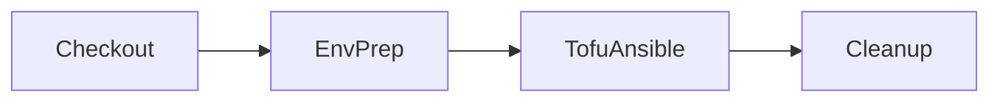

# Validation Pipeline Helper Inventory (Planning)

## Scope
This planning document catalogs helper logic defined in [`validation/pipeline/ci/airgap.groovy`](validation/pipeline/ci/airgap.groovy:1), [`validation/pipeline/ci/docker_helper.groovy`](validation/pipeline/ci/docker_helper.groovy:1), [`validation/pipeline/ci/helpers.groovy`](validation/pipeline/ci/helpers.groovy:1), and the Jenkinsfiles [`validation/pipeline/Jenkinsfile.setup.airgap.rke2`](validation/pipeline/Jenkinsfile.setup.airgap.rke2:1) plus [`validation/pipeline/Jenkinsfile.destroy.airgap.rke2`](validation/pipeline/Jenkinsfile.destroy.airgap.rke2:1). Functions are grouped by checkout, environment preparation, tofu/ansible execution, and cleanup responsibilities to guide future consolidation.

## Responsibility Buckets
- **Checkout** – Source repository acquisition and branch validation.
- **Environment Preparation** – Workspace resets, credential wiring, container image builds, shared volume setup, and terraform configuration generation.
- **Tofu / Ansible Execution** – Provisioning orchestration via OpenTofu and Ansible scripts, including artifact extraction and reporting.
- **Cleanup & Verification** – Teardown flows, artifact bundling, S3 hygiene, docker cleanup, and verification helpers.

## Delivery Flow Overview

## [`validation/pipeline/ci/airgap.groovy`](validation/pipeline/ci/airgap.groovy:1)
### Checkout
- [`checkoutRepositories()`](validation/pipeline/ci/airgap.groovy:52) – Clones rancher-tests and qa-infra-automation repositories, enforcing CleanCheckout and surfacing branch/commit info.

### Environment Preparation
- [`configureEnv()`](validation/pipeline/ci/airgap.groovy:10) – Wraps credentials setup while delegating contextual logging to the pipeline.
- [`prepareInfra()`](validation/pipeline/ci/airgap.groovy:17) – Calls build/volume/SSH helpers and validates parameters prior to provisioning.
- [`setupEnv()`](validation/pipeline/ci/airgap.groovy:30) – Clears workspace, loads params.yaml via [`ciHelpers().readParamsYaml()`](validation/pipeline/ci/helpers.groovy:3), and logs container metadata.
- [`buildDockerImage()`](validation/pipeline/ci/airgap.groovy:249) – Builds validation image with reproducibility metadata.
- [`createSharedVolume()`](validation/pipeline/ci/airgap.groovy:274) – Ensures shared docker volume is present for downstream steps.
- [`ensureSSHKeysInContainer()`](validation/pipeline/ci/airgap.groovy:279) – Copies SSH materials into the volume with fallbacks to pipeline hooks.
- [`generateTofuConfiguration()`](validation/pipeline/ci/airgap.groovy:523) – Writes terraform variable and backend configs inside qa-infra-automation module path.
- [`configureDestructionEnvironment()`](validation/pipeline/ci/airgap.groovy:568) – Rebuilds image/volume and env prerequisites for teardown flows.
- [`generateDestructionEnvironmentFile()`](validation/pipeline/ci/airgap.groovy:577) – Emits destruction .env file with workspace-aware S3 prefixing.
- [`ensureDestructionSSHKeys()`](validation/pipeline/ci/airgap.groovy:635) – Materializes SSH key files for cleanup containers.

### Tofu / Ansible Execution
- [`deployInfrastructure()`](validation/pipeline/ci/airgap.groovy:101) – Validates required variables, generates configs, and runs airgap infrastructure deploy script.
- [`prepareAnsibleEnv()`](validation/pipeline/ci/airgap.groovy:153) – Executes Ansible prep script with validated inputs.
- [`deployRKE2()`](validation/pipeline/ci/airgap.groovy:187) – Launches RKE2 deployment with cleanup on failure.
- [`deployRancher()`](validation/pipeline/ci/airgap.groovy:214) – Runs Rancher deploy script and triggers failure cleanup if needed.
- [`archiveCommonArtifacts()`](validation/pipeline/ci/airgap.groovy:241) – Convenience wrapper to persist common artifact lists.
- [`extractArtifactsFromDockerVolume()`](validation/pipeline/ci/airgap.groovy:367) – Copies terraform state, inventories, kubeconfig, and tfvars from shared volume.
- [`generateDeploymentSummary()`](validation/pipeline/ci/airgap.groovy:480) – Builds deployment-summary.json capturing versions, artifacts, and metadata.

### Cleanup & Verification
- [`cleanupContainersAndVolumes()`](validation/pipeline/ci/airgap.groovy:337) – Stops containers, removes images/volumes, and securely shreds env files.
- [`shellQuote()`](validation/pipeline/ci/airgap.groovy:652), [`mergeCleanupOptions()`](validation/pipeline/ci/airgap.groovy:663), [`buildCleanupArguments()`](validation/pipeline/ci/airgap.groovy:695) – Sanitize and assemble command arguments for cleanup scripts.
- [`runCleanupWorkflow()`](validation/pipeline/ci/airgap.groovy:715) – Executes airgap cleanup script inside container with merged environment variables.
- [`verifyCleanupState()`](validation/pipeline/ci/airgap.groovy:755) – Ensures OpenTofu state is empty after destruction.
- [`destroyInfrastructure()`](validation/pipeline/ci/airgap.groovy:793) – Orchestrates cleanup workflow and optional verification.
- [`archiveDestructionResults()`](validation/pipeline/ci/airgap.groovy:808) – Captures destruction summary artifacts from container.
- [`archiveDestructionFailureArtifacts()`](validation/pipeline/ci/airgap.groovy:825) – Retrieves diagnostic files (workspace list, remaining resources) on failure.
- [`cleanupS3WorkspaceDirectory()`](validation/pipeline/ci/airgap.groovy:861) – Removes S3 workspace directories using AWS CLI container.
- [`archiveArtifactsByType()`](validation/pipeline/ci/airgap.groovy:932), [`archiveFailureArtifactsByType()`](validation/pipeline/ci/airgap.groovy:948), [`archiveBuildArtifacts()`](validation/pipeline/ci/airgap.groovy:963) – Provide artifact bundles per stage outcome.
- [`executeInfrastructureCleanup()`](validation/pipeline/ci/airgap.groovy:976) – Runs legacy cleanup script path used by earlier Jenkinsfiles.

### Cross-Cutting Support
- [`logInfo()`](validation/pipeline/ci/airgap.groovy:911), [`logWarning()`](validation/pipeline/ci/airgap.groovy:912), [`logError()`](validation/pipeline/ci/airgap.groovy:913) – Timestamped logging utilities.
- [`getArtifactDefinitions()`](validation/pipeline/ci/airgap.groovy:917) – Central artifact manifest consumed by archive helpers.

## [`validation/pipeline/ci/docker_helper.groovy`](validation/pipeline/ci/docker_helper.groovy:1)
### Environment Preparation
- [`DockerExecutionHelper`](validation/pipeline/ci/docker_helper.groovy:5) – Serializable wrapper binding Jenkins pipeline context for docker execution.
- [`executeScriptInContainer()`](validation/pipeline/ci/docker_helper.groovy:13) – Primary entry point that writes scripts, composes env vars, and constructs docker commands.
- [`buildWorkspaceEnvFlags()`](validation/pipeline/ci/docker_helper.groovy:27), [`prepareEnvironmentVariables()`](validation/pipeline/ci/docker_helper.groovy:31) – Populate workspace/env flags for docker invocations.
- [`prepareDockerCommand()`](validation/pipeline/ci/docker_helper.groovy:52) – Builds main docker run command including mounts and env file attachments.
- [`prepareFallbackDockerCommand()`](validation/pipeline/ci/docker_helper.groovy:172) and [`collectFallbackVolumeMounts()`](validation/pipeline/ci/docker_helper.groovy:249) – Generate alternate command path when env file mounting fails.
- [`credentialsBindings()`](validation/pipeline/ci/docker_helper.groovy:163) and [`writeCredentialEnvironmentFile()`](validation/pipeline/ci/docker_helper.groovy:479) – Manage credential scope through temporary env files.
- [`collectVolumeMounts()`](validation/pipeline/ci/docker_helper.groovy:207) and [`resolveInventoryMount()`](validation/pipeline/ci/docker_helper.groovy:305) – Mount validation volume, repositories, and optional inventory.

### Tofu / Ansible Execution
- [`executeDockerCommand()`](validation/pipeline/ci/docker_helper.groovy:80) – Runs the docker command with timeout handling, fallback routing, and log masking.
- [`attemptPrimaryExecution()`](validation/pipeline/ci/docker_helper.groovy:105) and [`attemptFallbackExecution()`](validation/pipeline/ci/docker_helper.groovy:119) – Resilient execution branches for container scripts.
- [`addCredentialEnvFile()`](validation/pipeline/ci/docker_helper.groovy:503) and [`extractDirectEnvironmentVariables()`](validation/pipeline/ci/docker_helper.groovy:432) – Inject env data needed by Tofu/Ansible scripts.

### Cleanup & Verification
- [`cleanupExecutionArtifacts()`](validation/pipeline/ci/docker_helper.groovy:146) – Removes temporary script files and shreds credential env files.
- [`cleanupDanglingContainers()`](validation/pipeline/ci/docker_helper.groovy:360) – Stops and removes containers matching the build pattern.
- [`maskSensitiveData()`](validation/pipeline/ci/docker_helper.groovy:377) and [`provideDockerDiagnostics()`](validation/pipeline/ci/docker_helper.groovy:407) – Sanitize logged commands and emit diagnostics post-failure.
- [`validateDockerEnvironment()`](validation/pipeline/ci/docker_helper.groovy:321) and [`validateDockerImage()`](validation/pipeline/ci/docker_helper.groovy:341) – Preflight docker host and image availability.

### Checkout
- *No repository checkout helpers; class scope is container execution.*

## [`validation/pipeline/ci/helpers.groovy`](validation/pipeline/ci/helpers.groovy:1)
### Environment Preparation
- [`readParamsYaml()`](validation/pipeline/ci/helpers.groovy:3) – Loads config/params.yaml if present.
- [`createCredentialEnvironmentFile()`](validation/pipeline/ci/helpers.groovy:16) – Writes temporary credential env file with secure permissions.
- [`addCredentialEnvFileToDockerCommand()`](validation/pipeline/ci/helpers.groovy:38) – Inserts --env-file argument into docker command strings.
- [`buildDockerImage()`](validation/pipeline/ci/helpers.groovy:157) – Legacy helper building validation Docker image.
- [`createSharedVolume()`](validation/pipeline/ci/helpers.groovy:179) – Simple wrapper to create shared docker volume.

### Tofu / Ansible Execution
- [`executeScriptInContainer()`](validation/pipeline/ci/helpers.groovy:62) – Earlier helper for running scripts inside validation volume.
- [`executeInContainer()`](validation/pipeline/ci/helpers.groovy:105) – Executes arbitrary command lists in container for diagnostics.

### Cleanup & Verification
- [`cleanupContainersAndVolumes()`](validation/pipeline/ci/helpers.groovy:140) – Simplified docker cleanup routine predating enhanced library helpers.

### Checkout
- *No checkout helpers defined in this file.*

## Jenkinsfile Embedded Helpers (Airgap Pipelines)

### [`validation/pipeline/Jenkinsfile.setup.airgap.rke2`](validation/pipeline/Jenkinsfile.setup.airgap.rke2:1)
#### Checkout
- [`ciHelpers()`](validation/pipeline/Jenkinsfile.setup.airgap.rke2:39) lazily loads shared CI helper library paths so stage scripts can reuse Groovy helpers shipped with the repo.
- [`ciAirgap()`](validation/pipeline/Jenkinsfile.setup.airgap.rke2:55) provides the same lazy-loading pattern for [`validation/pipeline/ci/airgap.groovy`](validation/pipeline/ci/airgap.groovy:1), ensuring checkout/prepare/deploy helpers are always available.
- [`dockerHelper()`](validation/pipeline/Jenkinsfile.setup.airgap.rke2:74) resolves and instantiates the [`DockerExecutionHelper`](validation/pipeline/ci/docker_helper.groovy:5) so subsequent stages can execute scripts in the build container.

#### Environment Preparation
- [`configureEnvironmentComplete()`](validation/pipeline/Jenkinsfile.setup.airgap.rke2:196) orchestrates Ansible variable validation, environment variable assignment, credential setup, and sensitive-data checks ahead of provisioning.
- [`readAndValidateAnsibleVariables()`](validation/pipeline/Jenkinsfile.setup.airgap.rke2:227) enforces presence of the `ANSIBLE_VARIABLES` payload and records it for downstream use.
- [`setupSSHKeysSecure()`](validation/pipeline/Jenkinsfile.setup.airgap.rke2:241) materializes SSH keys inside the workspace with format validation and optional public key generation.
- [`generateEnvironmentFileComplete()`](validation/pipeline/Jenkinsfile.setup.airgap.rke2:287) writes the end-to-end `.env` file consumed by containerized scripts, including Terraform/Ansible metadata.
- [`extractAWSVariablesFromTerraformConfig()`](validation/pipeline/Jenkinsfile.setup.airgap.rke2:336) scrapes the `TERRAFORM_CONFIG` blob for `AWS_*` overrides that inform the environment file.
- [`getCredentialsList()`](validation/pipeline/Jenkinsfile.setup.airgap.rke2:815) supplies the standard AWS credential bindings used in setup hooks.
- [`getShortJobName()`](validation/pipeline/Jenkinsfile.setup.airgap.rke2:828) collapses nested Jenkins folder names to a job identifier for image/volume naming.
- [`cleanupSSHKeys()`](validation/pipeline/Jenkinsfile.setup.airgap.rke2:841) securely shreds workspace key material when the build completes or fails.
- [`buildDockerImage()`](validation/pipeline/Jenkinsfile.setup.airgap.rke2:887) delegates image construction to the shared library while enforcing presence of the helper function.
- [`createSharedVolume()`](validation/pipeline/Jenkinsfile.setup.airgap.rke2:896) similarly defers to the library to provision the shared Docker volume.
- [`ensureSSHKeysInContainer()`](validation/pipeline/Jenkinsfile.setup.airgap.rke2:905) guarantees keys are present within the shared volume, creating ephemeral keys if required.

#### Tofu / Ansible Execution
- [`runValidationHelper()`](validation/pipeline/Jenkinsfile.setup.airgap.rke2:153) resolves shell helper scripts and executes targeted functions with injected environment parameters.
- [`validateParameters()`](validation/pipeline/Jenkinsfile.setup.airgap.rke2:741) kicks off helper-based validation for user-supplied pipeline parameters.
- [`validateRequiredVariables()`](validation/pipeline/Jenkinsfile.setup.airgap.rke2:763) checks critical environment variables via the helper shell script.
- [`validateSensitiveDataHandling()`](validation/pipeline/Jenkinsfile.setup.airgap.rke2:787) confirms `.env` and SSH assets meet security requirements.
- [`archiveArtifactsByType()`](validation/pipeline/Jenkinsfile.setup.airgap.rke2:1021), [`archiveFailureArtifactsByType()`](validation/pipeline/Jenkinsfile.setup.airgap.rke2:1028), and [`archiveBuildArtifacts()`](validation/pipeline/Jenkinsfile.setup.airgap.rke2:1032) proxy artifact collection to the library by outcome.
- [`handleFailureCleanup()`](validation/pipeline/Jenkinsfile.setup.airgap.rke2:1042) centralizes error handling, artifact extraction, and conditional destruction when stages fail.
- [`executeInfrastructureCleanup()`](validation/pipeline/Jenkinsfile.setup.airgap.rke2:1079) funnels cleanup back into the shared library for consolidated scripting.

#### Cleanup & Verification
- [`cleanupContainersAndVolumes()`](validation/pipeline/Jenkinsfile.setup.airgap.rke2:992) ensures Docker resources are torn down via the shared library implementation.
- [`logInfo()`](validation/pipeline/Jenkinsfile.setup.airgap.rke2:721), [`logError()`](validation/pipeline/Jenkinsfile.setup.airgap.rke2:725), and [`logWarning()`](validation/pipeline/Jenkinsfile.setup.airgap.rke2:729) provide timestamped logging wrappers used across stages.

### [`validation/pipeline/Jenkinsfile.destroy.airgap.rke2`](validation/pipeline/Jenkinsfile.destroy.airgap.rke2:1)
#### Checkout
- [`ciHelpers()`](validation/pipeline/Jenkinsfile.destroy.airgap.rke2:332) and [`ciAirgap()`](validation/pipeline/Jenkinsfile.destroy.airgap.rke2:349) lazily load shared Groovy libraries so the destruction flow can reuse existing helper implementations.
- [`callLibraryMethod()`](validation/pipeline/Jenkinsfile.destroy.airgap.rke2:365) invokes shared-library routines defensively, signalling when helpers are missing.

#### Environment Preparation
- [`composeDestroyContext()`](validation/pipeline/Jenkinsfile.destroy.airgap.rke2:22) assembles the parameter-derived context map passed into the shared destroy pipeline entry point.
- [`validateParameters()`](validation/pipeline/Jenkinsfile.destroy.airgap.rke2:385) enforces required inputs such as `TARGET_WORKSPACE` and repository locations before teardown.
- [`validateRequiredVariables()`](validation/pipeline/Jenkinsfile.destroy.airgap.rke2:401) ensures critical environment variables are populated prior to calling the library.
- [`getShortJobName()`](validation/pipeline/Jenkinsfile.destroy.airgap.rke2:421) standardizes job identifiers for naming Docker artifacts.
- [`getCredentialsList()`](validation/pipeline/Jenkinsfile.destroy.airgap.rke2:430) defines AWS credential bindings for destruction operations.
- [`getS3BucketName()`](validation/pipeline/Jenkinsfile.destroy.airgap.rke2:477), [`getS3KeyPrefix()`](validation/pipeline/Jenkinsfile.destroy.airgap.rke2:485), and [`getS3BucketRegion()`](validation/pipeline/Jenkinsfile.destroy.airgap.rke2:493) normalize parameter-driven S3 settings.
- [`getAwsRegion()`](validation/pipeline/Jenkinsfile.destroy.airgap.rke2:501) derives the AWS region used by downstream scripts.

#### Tofu / Ansible Execution
- [`archiveBuildArtifacts()`](validation/pipeline/Jenkinsfile.destroy.airgap.rke2:437) collects destruction artifacts for auditing.

#### Cleanup & Verification
- [`cleanupContainersAndVolumes()`](validation/pipeline/Jenkinsfile.destroy.airgap.rke2:446) invokes the shared library cleanup routine after execution.
- [`performCleanup()`](validation/pipeline/Jenkinsfile.destroy.airgap.rke2:167) runs post-stage destruction cleanup and optionally purges the S3 workspace path.
- [`logInfo()`](validation/pipeline/Jenkinsfile.destroy.airgap.rke2:457), [`logError()`](validation/pipeline/Jenkinsfile.destroy.airgap.rke2:461), and [`logWarning()`](validation/pipeline/Jenkinsfile.destroy.airgap.rke2:465) provide consistent logging during teardown.
- [`requirePipeline()`](validation/pipeline/Jenkinsfile.destroy.airgap.rke2:184) guards stage execution by ensuring the shared destroy pipeline instance was initialized.
- [`timestamp()`](validation/pipeline/Jenkinsfile.destroy.airgap.rke2:471) supplies a common time format for log messages emitted during teardown.